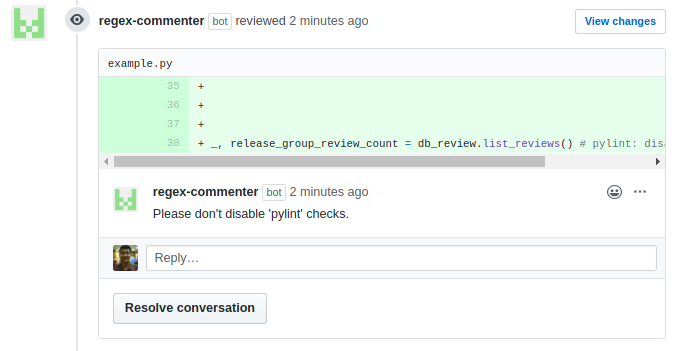
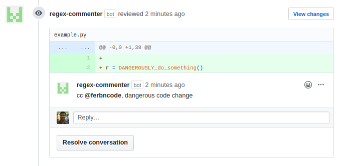
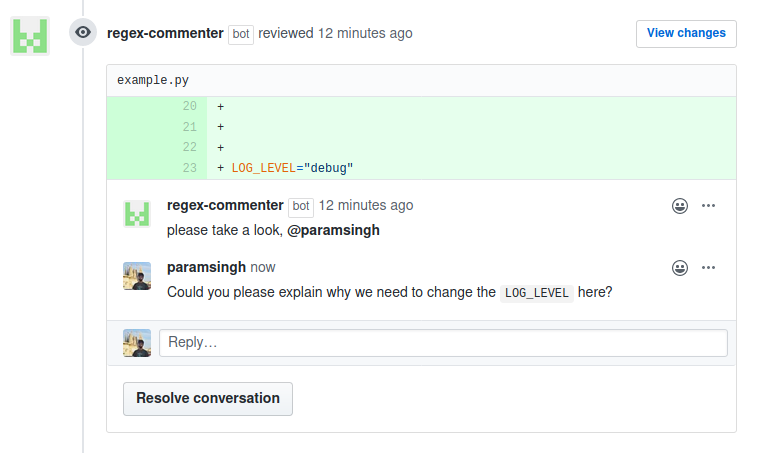

# Getting started

regex-commenter is a GitHub App build with [probot](https://probot.github.io/) that monitors pull requests
and comments on them if the diff matches your given regular expressions.

For example, you could use it to ask for clarifications on each `pylint: disable` in all pull
requests to your repository.

## Configuration

Install the app and add a `regex-commenter-config.yaml` to the `.github` directory in your repository.

Here's an example configuration.

```yaml
defaults:
  # the default comment if the PR diff matches any of the given regexes
  comment: "please take a look, @paramsingh"

matches:
  # An optional description of the regular expression
- description: "Comments on each pylint-disable in the pull request"

  # The regular expression that regex-commenter should match the diff against
  regex: ".*pylint: disable*"

  # The comment that regex-commenter will make if the diff matches this regex,
  comment: "Please don't disable 'pylint' checks."

- regex: ".*DANGEROUSLY_do_something*"
  comment: "cc @ferbncode, dangerous code change"

- regex: ".*LOG_LEVEL=*" # no comment specified, uses default comment.
```

## Example usecases

### Check for antipatterns like pylint-disable, ts-ignore etc.



### Monitor for uses of dangerous functions

```
def DANGEROUSLY_do_something():
    bring_down_everything()
```




### Tag code owners for easy code review


